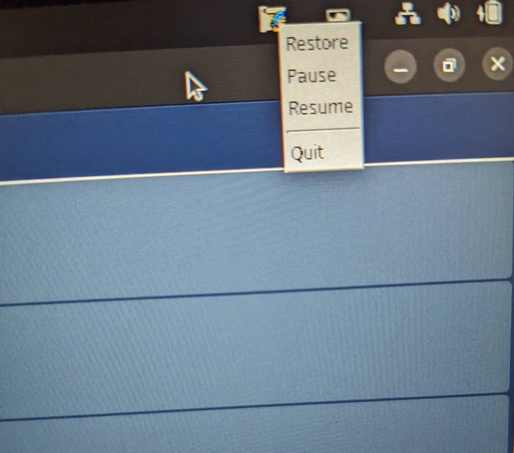

# Palimpsest

Palimpsest is a lightweight clipboard history manager for Linux, built with JavaFX. It captures up to 10 recent text copies, saves them to a JSON file, and runs in the system tray with pause, resume, restore, and exit options. Ideal for personal use, it offers a simple interface and optional auto-start.

## Features

- Stores up to 10 recent text copies with timestamps.
- Saves clipboard history to `~/.palimpsest/history.json` after each copy, loads at startup.
- System tray icon with:
  - Pause/resume clipboard monitoring.
  - Restore UI.
  - Exit app.

## Screenshots

**Application UI**  


**System Tray Icon**  


## Prerequisites

- **Java**: Oracle JDK 24 or OpenJDK 24, or any version as from 17.
- **Maven**: For building and dependency management.
- **System Tray Extension**: For GNOME (e.g., Ubuntu), install `gnome-shell-extension-appindicator`. For other desktops (e.g., KDE, XFCE), ensure `libappindicator` or equivalent.
  ```bash
  # Example for Ubuntu/Debian
  sudo apt install gnome-shell-extension-appindicator
  ```

## Installation

1. **Clone the Repository**:
   ```bash
   git clone <repository-url>
   cd Palimpsest/Palimpsest
   ```

2. **Verify Java 24**:
   ```bash
   java -version
   ```
   Ensure output shows `openjdk 24` or similar. Install Java 24 if needed.

3. **Build and Run**:
   ```bash
   mvn clean install
   mvn javafx:run
   ```

## Usage

- **Launch**: Run `mvn javafx:run`. The app opens a 900x500 window showing up to 10 clipboard entries.
- **Copy Text**: Copy text in any app (e.g., browser). Palimpsest captures it, adds a timestamp (e.g., “12:01 PM”), and shows it in the top row.
- **View/Copy History**: Click a “Copy” button next to an entry to paste it back to the clipboard.
- **System Tray**:
  - Close the window to minimize to the tray.
  - Right-click the tray icon for:
    - **Pause**: Stop monitoring.
    - **Resume**: Restart monitoring.
    - **Restore**: Show UI.
    - **Exit**: Close app.
- **Persistence**: History saves to `~/.palimpsest/history.json` after each copy and loads on startup.
- **Auto-Start**: Create a `.desktop` file in `~/.config/autostart/` to launch on login (user-configured).